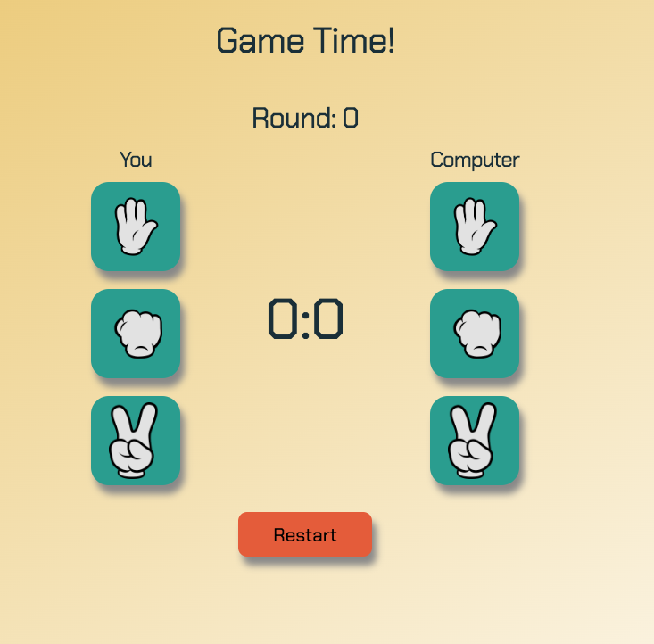

**About this project**

[Try it out!](https://susi189.github.io/rps-game/src/)

In this project I improved the design of the [first version](https://github.com/susi189/rock-paper-scissors) of the Rock-Paper-Scissors game and worked with

- CSS-Flexbox,
- CSS variables,
- CSS animations (@keyframes),
- working with libraries (added confetti to the "You are the winner!" page),
- working with event listeners
